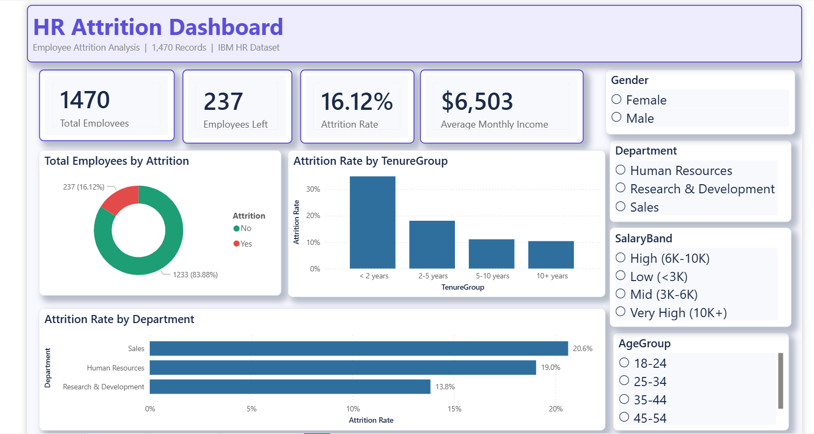
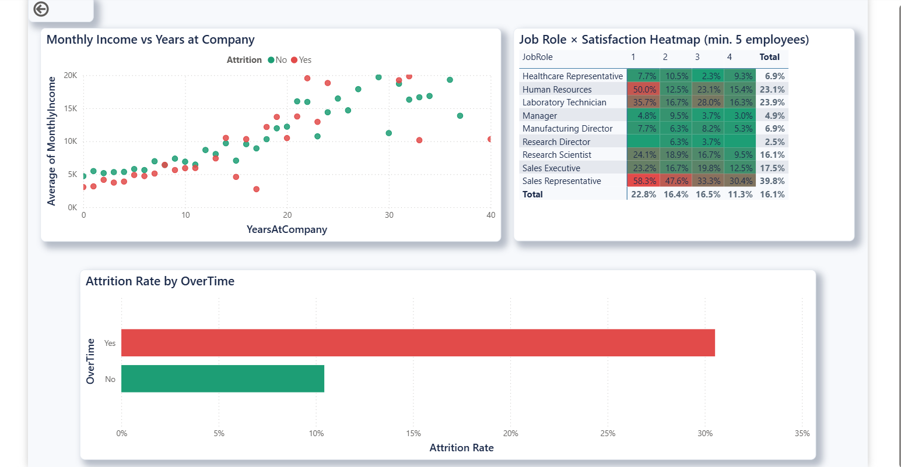
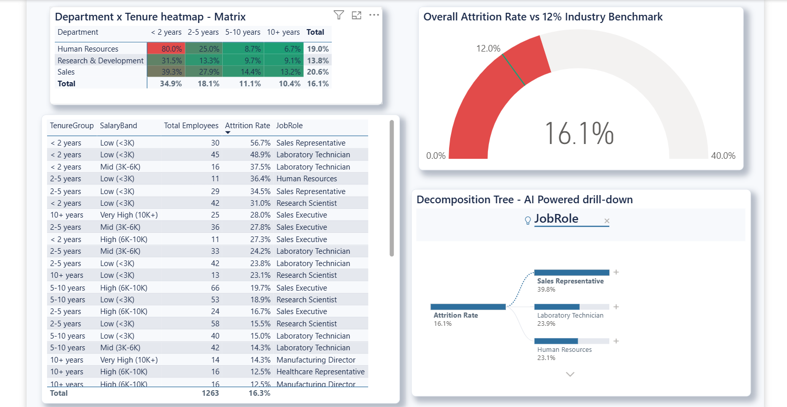

# HR Analytics Dashboard — Employee Attrition Insights

<p align="center">
  
  
  
  
  
  
</p>

> An end-to-end HR analytics solution built to understand why employees leave — covering database design, statistical analysis, and an interactive Power BI dashboard — delivering actionable retention recommendations backed by data.

---

## Business Problem

Employee attrition is one of the most costly and preventable problems in any organization. Replacing a single employee costs an estimated 1.5 to 2 times their annual salary when factoring in recruiting, onboarding, and lost productivity.

This project simulates the work of a data analyst embedded in an HR team, tasked with answering:

- Which departments and job roles have the highest attrition rates?
- What employee segments are most at risk of leaving?
- How do satisfaction scores, salary bands, and tenure relate to attrition?
- What targeted interventions can reduce voluntary turnover?

---

## Dashboard Preview

| Overview Page | Drill-Through Analysis | Risk Dashboard |
|---|---|---|
|  |  |  |

> Download the Power BI file: [HR_Attrition_Dashboard.pbix](dashboard/hr_attrition_dashboard.pbix)

---

## Key Findings

| Finding | Detail |
|---|---|
| Early-career employees are highest risk | Employees with less than 2 years tenure attrite at **32.6%** — nearly **3x** the rate of those with 10+ years (10.2%) |
| Compensation is a primary driver | Lowest salary band shows **26.5%** attrition vs **6.8%** in the highest band |
| Overtime significantly predicts attrition | Overtime workers leave at **30.5%** vs **10.4%** for non-overtime employees |
| Sales department needs immediate attention | **20.6%** attrition rate — highest across all departments; Sales Representatives at **39.8%** |
| Job satisfaction is measurable and actionable | Score 1 (Low) correlates with **22.8%** attrition vs **11.3%** for Score 4 (Very High) |

*All findings were validated using formal statistical tests (Chi-Square, Mann-Whitney U, Point-Biserial Correlation).*

---

## Project Architecture

```
hr-attrition-analytics/
│
├── data/
│   ├── raw/                         # Original IBM HR dataset (1,470 records)
│   └── processed/                   # Cleaned and feature-engineered dataset
│
├── sql/
│   ├── 01_create_schema.sql         # PostgreSQL table schema with computed columns
│   ├── 02_load_data.sql             # Data loading and post-load validation
│   └── 03_analytical_queries.sql    # 10 business insight queries + Power BI view
│
├── notebooks/
│   ├── 01_data_cleaning.ipynb       # Type casting, feature engineering, export
│   ├── 02_eda_analysis.ipynb        # 8 publication-quality visualizations
│   └── 03_statistical_analysis.ipynb # Chi-square, correlation, significance tests
│
├── dashboard/
│   ├── HR_Attrition_Dashboard.pbix  # Power BI Desktop file (3 pages)
│   ├── POWERBI_GUIDE.md             # Step-by-step dashboard build guide
│   └── dashboard_screenshots/       # PNG previews for GitHub and LinkedIn
│
├── reports/
│   ├── executive_summary.md         # Business findings with ROI estimate
│   └── HR_Attrition_Business_Report.pdf
│
├── hr_theme.json                    # Custom Power BI color theme
├── requirements.txt
├── .gitignore
└── README.md
```

---

## Tech Stack

| Layer | Tool | Purpose |
|---|---|---|
| Data Storage | PostgreSQL 15 | Schema design, SQL analytics, computed columns |
| Data Processing | Python 3.11, pandas | Cleaning, transformation, feature engineering |
| Statistical Analysis | scipy, statsmodels | Hypothesis testing, correlation analysis |
| Visualization | seaborn, matplotlib | EDA charts, KDE plots, heatmaps |
| Business Dashboard | Power BI Desktop | Interactive 3-page dashboard with drill-through |
| Reporting | Markdown, PDF | Executive stakeholder deliverable |

---

## Statistical Methodology

This project goes beyond basic aggregations. Every finding was validated with a formal statistical test before being included in the business report.

- **Chi-Square Tests** — tested independence between categorical variables (e.g. department vs attrition, overtime vs attrition). Results confirmed these relationships are statistically significant and not due to chance.
- **Point-Biserial Correlation** — measured the linear relationship between continuous features (monthly income, years at company, satisfaction scores) and the binary attrition flag.
- **Mann-Whitney U Test** — compared income distributions between employees who left versus stayed. Used instead of a t-test because income data is right-skewed and not normally distributed.
- **Distribution Analysis** — KDE plots and box plots to visualize the income and satisfaction distributions for each attrition group.
- **Cohort Analysis** — tenure-based segmentation to identify the high-risk early-career window.

---

## How to Run This Project

### Prerequisites

```bash
# Install Python dependencies
pip install -r requirements.txt

# Verify PostgreSQL is running
psql --version   # should be 14+
```

### Step 1 — Set up the database

```bash
psql -U postgres -c "CREATE DATABASE hr_analytics;"
psql -U postgres -d hr_analytics -f sql/01_create_schema.sql
psql -U postgres -d hr_analytics -f sql/02_load_data.sql
```

### Step 2 — Download the dataset

Download the [IBM HR Analytics Dataset from Kaggle](https://www.kaggle.com/datasets/pavansubhasht/ibm-hr-analytics-attrition-dataset) and place it at:

```
data/raw/HR_Employee_Attrition.csv
```

### Step 3 — Run the notebooks in order

```bash
jupyter lab
# Run: 01_data_cleaning → 02_eda_analysis → 03_statistical_analysis
```

### Step 4 — Open the Power BI dashboard

Open `dashboard/HR_Attrition_Dashboard.pbix` in Power BI Desktop and update the data source path to your local `data/processed/hr_cleaned.csv`.

For a full walkthrough of how the dashboard was built, see [POWERBI_GUIDE.md](dashboard/POWERBI_GUIDE.md).

---

## Business Recommendations

Based on the analysis, five recommendations were made in the executive report:

- **Structured onboarding program** — implement 90-day and 12-month milestone check-ins targeting the under-2-years tenure window, which carries the highest attrition risk.
- **Compensation review** — conduct salary benchmarking for the two lowest salary bands, prioritizing Sales and R&D roles where attrition is highest.
- **Overtime policy audit** — set department-level overtime thresholds and add workload capacity planning to quarterly HR reviews.
- **Pulse surveys** — deploy quarterly micro-surveys for teams with average tenure under 2 years, with automated manager alerts when satisfaction scores drop to 2 or below.
- **Risk scoring in HRIS** — integrate the composite risk score (built from tenure, income, overtime, and satisfaction) into the HR system for real-time at-risk flagging.

Estimated impact: a 30% improvement in the high-risk segment could retain approximately 13 employees per year, saving an estimated $585,000 to $780,000 in replacement costs.

---

## Dataset

**IBM HR Analytics Employee Attrition and Performance**

- Source: [Kaggle — pavansubhasht](https://www.kaggle.com/datasets/pavansubhasht/ibm-hr-analytics-attrition-dataset)
- Records: 1,470 employees
- Features: 35 columns covering demographics, job information, satisfaction scores, and attrition flag
- Note: This is a synthetic dataset created by IBM for educational purposes.

---

## Author

**Aryan Singh** — Aspiring Data Analyst

[](https://github.com/Aryansingh-B)

---

## License

This project is for educational and portfolio purposes.  
Dataset © IBM, distributed via Kaggle.